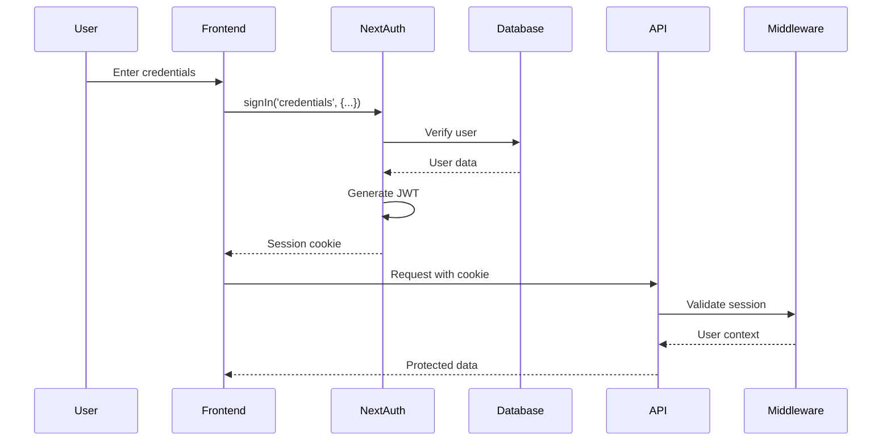
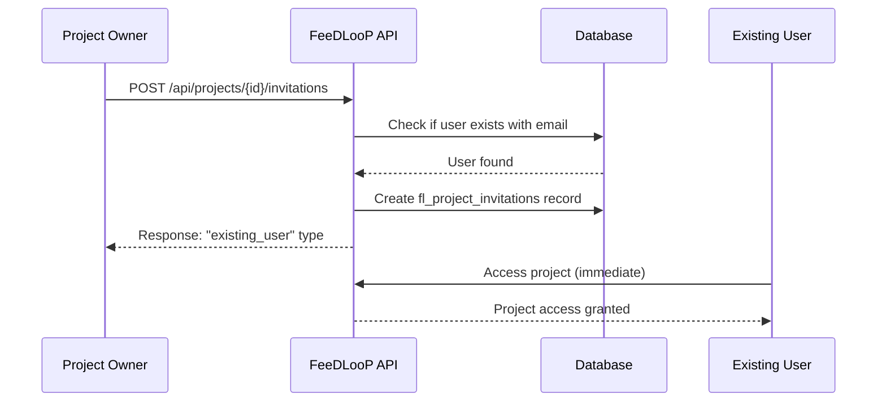
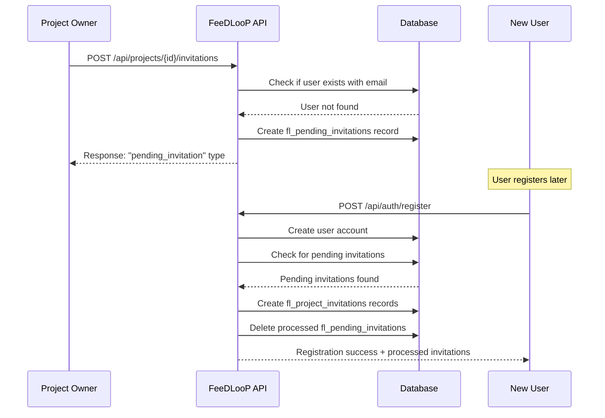

# 🚀 FeeDLooP API Documentation

> **Version**: 1.0.0
> **Last Updated**: December 2024
> **Base URL**: `https://your-domain.com/api`
> **Authentication**: NextAuth.js JWT Sessions

## 📖 Table of Contents

1. [Overview](#overview)
2. [Authentication](#authentication)
3. [API Endpoints](#api-endpoints)
   - [Authentication Endpoints](#authentication-endpoints)
   - [Project Management](#project-management)
   - [Team Management](#team-management)
   - [Report Management](#report-management)
   - [Widget API](#widget-api)
   - [File Uploads](#file-uploads)
   - [Export Functions](#export-functions)
4. [Request/Response Formats](#requestresponse-formats)
5. [Error Handling](#error-handling)
6. [Rate Limiting](#rate-limiting)
7. [Widget Integration](#widget-integration)
8. [Testing Endpoints](#testing-endpoints)

---

## Overview

The FeeDLooP API provides a RESTful interface for managing feedback collection, project management, and team collaboration. All endpoints (except public widget submission) require authentication via NextAuth.js session tokens.

### Key Features
- 🔐 **Secure Authentication** with NextAuth.js v5
- 📊 **Project Management** with team collaboration
- 🐛 **Feedback Collection** via embeddable widget
- 📎 **File Attachments** support (up to 5 per report)
- 📤 **CSV Export** for Jira/Azure DevOps integration
- 🛡️ **Row Level Security** with Supabase
- ✉️ **Email-Based Invitations** with automatic processing for new users
- ⏳ **Pending Invitation Management** with 7-day expiration

### Technology Stack
- **Framework**: Next.js 15.5.3 with App Router
- **Authentication**: NextAuth.js v5 (JWT strategy)
- **Database**: Supabase (PostgreSQL)
- **Validation**: Zod schemas
- **File Storage**: MinIO (S3-compatible)

---

## Authentication

### Overview
FeeDLooP uses NextAuth.js v5 with JWT session tokens for authentication. Sessions last for 30 days and are automatically refreshed on activity.

### Authentication Flow



### Session Management

All protected endpoints require a valid session cookie. The middleware automatically:
- Validates the session token
- Extracts user information
- Adds user context to request headers (`x-user-id`, `x-user-email`)
- Redirects unauthenticated users (for page routes) or returns 401 (for API routes)

### Public Endpoints

The following endpoints do NOT require authentication:
- `POST /api/auth/register` - User registration
- `POST /api/auth/login` - User login (handled by NextAuth)
- `POST /api/widget/submit` - Public widget submissions
- `GET /api/health` - Health check
- `GET /api/test-db` - Database connectivity test (dev only)

---

## API Endpoints

### Authentication Endpoints

#### 📝 User Registration (Enhanced)
```http
POST /api/auth/register
```

Creates a new user account with automatic processing of pending project invitations. When a user registers with an email that has pending invitations, the system automatically grants access to those projects.

**Request Body:**
```json
{
  "email": "user@example.com",
  "password": "SecurePass123!",
  "first_name": "John",
  "last_name": "Doe",
  "company": "Acme Corp"
}
```

**Validation Requirements:**
- Email: Valid email format, unique, max 255 characters
- Password: Min 8 chars, must include uppercase, lowercase, number, special character
- Names: 1-50 characters each
- Company: 1-100 characters

**Response (201 Created) - No Pending Invitations:**
```json
{
  "user": {
    "id": "uuid",
    "email": "user@example.com",
    "first_name": "John",
    "last_name": "Doe",
    "company": "Acme Corp",
    "created_at": "2024-12-19T00:00:00Z"
  },
  "message": "Account created successfully"
}
```

**Response (201 Created) - With Pending Invitations:**
```json
{
  "user": {
    "id": "uuid",
    "email": "user@example.com",
    "first_name": "John",
    "last_name": "Doe",
    "company": "Acme Corp",
    "created_at": "2024-12-19T00:00:00Z"
  },
  "processed_invitations": [
    {
      "project_id": "uuid",
      "project_name": "Example Project",
      "role": "member",
      "can_invite": false,
      "invited_by": {
        "email": "owner@example.com",
        "name": "Project Owner"
      }
    },
    {
      "project_id": "uuid",
      "project_name": "Another Project",
      "role": "admin",
      "can_invite": true,
      "invited_by": {
        "email": "admin@example.com",
        "name": "Admin User"
      }
    }
  ],
  "message": "Account created successfully and 2 pending invitations processed"
}
```

**Automatic Invitation Processing:**
When a new user registers, the system automatically:
1. Checks for pending invitations with matching email
2. Creates project memberships for all valid pending invitations
3. Removes processed pending invitations from the database
4. Skips expired invitations (older than 7 days)
5. Returns information about processed invitations in the response

**Error Responses:**
- `400` - Validation failed
- `409` - Email already exists
- `500` - Server error

#### 🔑 User Login
```http
POST /api/auth/callback/credentials
```

Handled by NextAuth.js. Use the `signIn()` function from `next-auth/react` in the frontend.

**Frontend Usage:**
```javascript
import { signIn } from 'next-auth/react'

const result = await signIn('credentials', {
  email: 'user@example.com',
  password: 'SecurePass123!',
  redirect: false
})
```

#### 🔍 Get Session
```http
GET /api/auth/session
```

Returns the current user session information.

**Response (200 OK):**
```json
{
  "user": {
    "id": "uuid",
    "email": "user@example.com",
    "first_name": "John",
    "last_name": "Doe",
    "company": "Acme Corp",
    "avatar_url": null
  },
  "expires": "2025-01-18T00:00:00Z"
}
```

#### 🚪 Sign Out
```http
POST /api/auth/signout
```

Handled by NextAuth.js. Use the `signOut()` function from `next-auth/react`.

---

### Project Management

#### 📋 List Projects
```http
GET /api/projects
```

Returns all projects where the user is either owner or team member.

**Response (200 OK):**
```json
[
  {
    "id": "uuid",
    "name": "My Project",
    "owner_id": "uuid",
    "integration_key": "flp_xxxxxxxxxxxxx",
    "created_at": "2024-12-19T00:00:00Z"
  }
]
```

#### ➕ Create Project
```http
POST /api/projects
```

Creates a new project with the authenticated user as owner.

**Request Body:**
```json
{
  "name": "My New Project"
}
```

**Response (201 Created):**
```json
{
  "id": "uuid",
  "name": "My New Project",
  "owner_id": "uuid",
  "integration_key": "auto-generated-key",
  "created_at": "2024-12-19T00:00:00Z"
}
```

**Error Responses:**
- `400` - Invalid project name
- `401` - Not authenticated
- `409` - Project name already exists

#### 🔍 Get Project Details
```http
GET /api/projects/{projectId}
```

Returns detailed project information including active team members and pending invitations.

**Response (200 OK):**
```json
{
  "id": "uuid",
  "name": "My Project",
  "owner_id": "uuid",
  "integration_key": "flp_xxxxxxxxxxxxx",
  "created_at": "2024-12-19T00:00:00Z",
  "members": [
    {
      "user_id": "uuid",
      "invitation_id": "uuid",
      "email": "owner@example.com",
      "name": "John Doe",
      "role": "owner",
      "can_invite": true,
      "status": "active",
      "created_at": "2024-12-19T00:00:00Z"
    },
    {
      "user_id": "uuid",
      "invitation_id": "uuid",
      "email": "member@example.com",
      "name": "Jane Smith",
      "role": "member",
      "can_invite": false,
      "status": "active",
      "created_at": "2024-12-19T01:00:00Z"
    },
    {
      "user_id": null,
      "invitation_id": "uuid",
      "email": "pending@example.com",
      "name": null,
      "role": "admin",
      "can_invite": true,
      "status": "pending",
      "expires_at": "2024-12-26T00:00:00Z",
      "created_at": "2024-12-19T02:00:00Z"
    }
  ],
  "team_summary": {
    "active_members": 2,
    "pending_invitations": 1,
    "total": 3
  }
}
```

**Member Status Definitions:**
- `active`: User has registered and has active project access
- `pending`: Email invitation sent, user hasn't registered yet

**Error Responses:**
- `400` - Invalid project ID format
- `404` - Project not found or no access
- `401` - Not authenticated

#### ✏️ Update Project
```http
PUT /api/projects/{projectId}
```

Updates project details. Only project owners can update projects.

**Request Body:**
```json
{
  "name": "Updated Project Name"
}
```

**Response (200 OK):**
```json
{
  "id": "uuid",
  "name": "Updated Project Name",
  "owner_id": "uuid",
  "integration_key": "flp_xxxxxxxxxxxxx",
  "created_at": "2024-12-19T00:00:00Z"
}
```

**Error Responses:**
- `400` - Invalid data
- `403` - Not project owner
- `404` - Project not found
- `409` - Name already exists

#### 🗑️ Delete Project
```http
DELETE /api/projects/{projectId}
```

Deletes a project and all associated data. Only project owners can delete projects.

**Response:**
- `204 No Content` - Success
- `403` - Not project owner
- `404` - Project not found

---

### Team Management

#### 👥 Invite Team Member (Enhanced)
```http
POST /api/projects/{projectId}/invitations
```

Invites a user to join the project team using email-based invitations. The system supports both existing and non-existing users:
- **Existing users**: Instantly added to the project team with active status
- **Non-existing users**: Creates a pending invitation that gets processed automatically when they register

**Request Body:**
```json
{
  "email": "newmember@example.com",
  "role": "member",
  "can_invite": false
}
```

**Validation Rules:**
- `email`: Valid email format, max 255 characters
- `role`: One of "member", "admin" (owners cannot be created via API)
- `can_invite`: Boolean, determines if member can invite others

**Response for Existing User (201 Created):**
```json
{
  "type": "existing_user",
  "member": {
    "id": "uuid",
    "project_id": "uuid",
    "user_id": "uuid",
    "email": "newmember@example.com",
    "role": "member",
    "can_invite": false,
    "status": "active",
    "created_at": "2024-12-19T00:00:00Z"
  },
  "message": "User added to project successfully"
}
```

**Response for Non-Existing User (201 Created):**
```json
{
  "type": "pending_invitation",
  "pending_invitation": {
    "id": "uuid",
    "project_id": "uuid",
    "email": "newuser@example.com",
    "role": "member",
    "can_invite": false,
    "invitation_token": "abc123...xyz789",
    "expires_at": "2024-12-26T00:00:00Z",
    "created_at": "2024-12-19T00:00:00Z"
  },
  "message": "Pending invitation created for non-registered user"
}
```

**Error Responses:**
- `400` - Invalid email, role, or validation failed
- `403` - No permission to invite
- `404` - Project not found
- `409` - User already invited or pending invitation exists

#### 👥 Get Team Members
```http
GET /api/projects/{projectId}/invitations
```

Returns all team members including active members and pending invitations.

**Response (200 OK):**
```json
{
  "members": [
    {
      "user_id": "uuid",
      "invitation_id": "uuid",
      "email": "owner@example.com",
      "name": "Project Owner",
      "role": "owner",
      "can_invite": true,
      "status": "active",
      "created_at": "2024-12-19T00:00:00Z"
    },
    {
      "user_id": "uuid",
      "invitation_id": "uuid",
      "email": "member@example.com",
      "name": "Active Member",
      "role": "member",
      "can_invite": false,
      "status": "active",
      "created_at": "2024-12-19T01:00:00Z"
    },
    {
      "user_id": null,
      "invitation_id": "uuid",
      "email": "pending@example.com",
      "name": null,
      "role": "member",
      "can_invite": false,
      "status": "pending",
      "expires_at": "2024-12-26T00:00:00Z",
      "created_at": "2024-12-19T02:00:00Z"
    }
  ],
  "counts": {
    "active": 2,
    "pending": 1,
    "total": 3
  }
}
```

#### ❌ Remove Team Member
```http
DELETE /api/projects/{projectId}/invitations/{invitationId}
```

Removes a team member from the project. Works for both active members and pending invitations.

**Path Parameters:**
- `invitationId`: The invitation record ID (not user ID)

**Response:**
- `204 No Content` - Success
- `403` - No permission (only owners and admin with can_invite=true)
- `404` - Member not found or project not found

**Notes:**
- Project owners cannot be removed
- Removing an active member revokes their project access immediately
- Removing a pending invitation prevents future access when they register

#### 🔄 Update Team Member Role
```http
PUT /api/projects/{projectId}/invitations/{invitationId}
```

Updates a team member's role or permissions. Works for both active members and pending invitations.

**Request Body:**
```json
{
  "role": "admin",
  "can_invite": true
}
```

**Response (200 OK):**
```json
{
  "id": "uuid",
  "email": "member@example.com",
  "role": "admin",
  "can_invite": true,
  "status": "active",
  "updated_at": "2024-12-19T00:00:00Z"
}
```

**Error Responses:**
- `400` - Invalid role or validation failed
- `403` - No permission to update
- `404` - Member not found

#### 📋 Get Pending Invitations
```http
GET /api/projects/{projectId}/pending-invitations
```

Returns only pending invitations for the project.

**Response (200 OK):**
```json
{
  "pending_invitations": [
    {
      "id": "uuid",
      "project_id": "uuid",
      "email": "pending@example.com",
      "role": "member",
      "can_invite": false,
      "invitation_token": "abc123...xyz789",
      "expires_at": "2024-12-26T00:00:00Z",
      "invited_by": {
        "id": "uuid",
        "email": "inviter@example.com",
        "name": "Inviter Name"
      },
      "created_at": "2024-12-19T00:00:00Z"
    }
  ],
  "count": 1
}
```

#### 🔄 Resend Pending Invitation
```http
POST /api/projects/{projectId}/pending-invitations/{invitationId}/resend
```

Regenerates invitation token and extends expiration date for a pending invitation.

**Response (200 OK):**
```json
{
  "id": "uuid",
  "email": "pending@example.com",
  "invitation_token": "new_token_xyz789",
  "expires_at": "2025-01-02T00:00:00Z",
  "message": "Invitation refreshed and extended"
}
```

---

### Report Management

#### 📊 List Reports
```http
GET /api/projects/{projectId}/reports
```

Returns all reports for a project with optional filtering.

**Query Parameters:**
- `type` - Filter by type (bug, initiative, feedback)
- `status` - Filter by status (active, archived)
- `priority` - Filter by priority (low, medium, high, critical)
- `page` - Page number (default: 1)
- `limit` - Items per page (default: 20, max: 100)

**Response (200 OK):**
```json
{
  "reports": [
    {
      "id": "uuid",
      "type": "bug",
      "title": "Login button not working",
      "description": "The login button doesn't respond...",
      "status": "active",
      "priority": "high",
      "reporter_email": "user@example.com",
      "reporter_name": "John Doe",
      "url": "https://app.example.com/login",
      "created_at": "2024-12-19T00:00:00Z",
      "attachment_count": 2
    }
  ],
  "pagination": {
    "page": 1,
    "limit": 20,
    "total": 45,
    "total_pages": 3
  }
}
```

#### ➕ Create Report
```http
POST /api/projects/{projectId}/reports
```

Creates a new report (internal dashboard use).

**Request Body:**
```json
{
  "type": "bug",
  "title": "Bug Report Title",
  "description": "Detailed description...",
  "priority": "high",
  "reporter_email": "reporter@example.com",
  "reporter_name": "Reporter Name",
  "url": "https://app.example.com/page",
  "user_agent": "Mozilla/5.0...",
  "console_logs": [],
  "network_requests": []
}
```

**Response (201 Created):**
```json
{
  "id": "uuid",
  "project_id": "uuid",
  "type": "bug",
  "title": "Bug Report Title",
  "status": "active",
  "created_at": "2024-12-19T00:00:00Z"
}
```

#### 🔍 Get Report Details
```http
GET /api/projects/{projectId}/reports/{reportId}
```

Returns detailed report information including attachments.

**Response (200 OK):**
```json
{
  "id": "uuid",
  "project_id": "uuid",
  "type": "bug",
  "title": "Bug Report Title",
  "description": "Full description...",
  "status": "active",
  "priority": "high",
  "reporter_email": "reporter@example.com",
  "reporter_name": "Reporter Name",
  "url": "https://app.example.com/page",
  "user_agent": "Mozilla/5.0...",
  "console_logs": [...],
  "network_requests": [...],
  "created_at": "2024-12-19T00:00:00Z",
  "updated_at": "2024-12-19T00:00:00Z",
  "attachments": [
    {
      "id": "uuid",
      "filename": "screenshot.png",
      "file_size": 102400,
      "mime_type": "image/png",
      "created_at": "2024-12-19T00:00:00Z"
    }
  ]
}
```

#### ✏️ Update Report
```http
PUT /api/projects/{projectId}/reports/{reportId}
```

Updates report status, priority, or archives it.

**Request Body:**
```json
{
  "status": "archived",
  "priority": "low"
}
```

**Response (200 OK):**
```json
{
  "id": "uuid",
  "status": "archived",
  "priority": "low",
  "updated_at": "2024-12-19T00:00:00Z"
}
```

---

### Widget API

#### 🚀 Submit Feedback (Public)
```http
POST /api/widget/submit
```

Public endpoint for widget submissions. Does not require authentication.

**Request Body:**
```json
{
  "integration_key": "flp_xxxxxxxxxxxxx",
  "type": "bug",
  "title": "Bug Report from Widget",
  "description": "Description of the issue...",
  "reporter_email": "user@example.com",
  "reporter_name": "John Doe",
  "url": "https://yoursite.com/page",
  "user_agent": "Mozilla/5.0...",
  "console_logs": [...],
  "network_requests": [...],
  "attachments": ["base64-encoded-image-data"]
}
```

**Response (201 Created):**
```json
{
  "success": true,
  "report_id": "uuid",
  "message": "Thank you for your feedback!"
}
```

**Error Responses:**
- `400` - Invalid integration key or data
- `429` - Rate limit exceeded
- `500` - Server error

---

### File Uploads

#### 📎 Upload Attachment
```http
POST /api/uploads
```

Uploads files to MinIO storage for report attachments.

**Request:**
- Content-Type: `multipart/form-data`
- Max file size: 10MB
- Allowed types: PNG, JPG, GIF, PDF, DOCX, XLSX

**Form Data:**
```
file: [binary file data]
report_id: "uuid"
```

**Response (201 Created):**
```json
{
  "id": "uuid",
  "filename": "screenshot.png",
  "file_size": 102400,
  "mime_type": "image/png",
  "url": "https://storage.example.com/attachments/uuid/screenshot.png"
}
```

**Error Responses:**
- `400` - Invalid file type or size
- `403` - No access to report
- `413` - File too large
- `429` - Too many attachments (max 5)

---

### Export Functions

#### 📤 Export to CSV
```http
GET /api/projects/{projectId}/export
```

Exports project reports to CSV format compatible with Jira/Azure DevOps.

**Query Parameters:**
- `type` - Filter by report type
- `status` - Filter by status
- `from` - Start date (ISO 8601)
- `to` - End date (ISO 8601)

**Response:**
- Content-Type: `text/csv`
- Content-Disposition: `attachment; filename="feedloop-export-{date}.csv"`

**CSV Format:**
```csv
ID,Type,Title,Description,Status,Priority,Reporter,Created,URL
uuid,bug,"Title","Description",active,high,user@example.com,2024-12-19,https://...
```

---

## Request/Response Formats

### Standard Request Headers
```http
Content-Type: application/json
Accept: application/json
Cookie: next-auth.session-token=...
```

### Standard Response Format

**Success Response:**
```json
{
  "data": {...},
  "message": "Success message"
}
```

**Error Response:**
```json
{
  "error": "Error message",
  "details": [
    {
      "field": "email",
      "message": "Invalid email format"
    }
  ],
  "code": "ERROR_CODE"
}
```

### Pagination Format
```json
{
  "data": [...],
  "pagination": {
    "page": 1,
    "limit": 20,
    "total": 100,
    "total_pages": 5,
    "has_next": true,
    "has_prev": false
  }
}
```

---

## Error Handling

### HTTP Status Codes

| Code | Meaning | Usage |
|------|---------|-------|
| **200** | OK | Successful GET/PUT request |
| **201** | Created | Successful POST request |
| **204** | No Content | Successful DELETE request |
| **400** | Bad Request | Invalid input data |
| **401** | Unauthorized | Authentication required |
| **403** | Forbidden | No permission for resource |
| **404** | Not Found | Resource doesn't exist |
| **409** | Conflict | Duplicate resource |
| **413** | Payload Too Large | File size exceeded |
| **429** | Too Many Requests | Rate limit exceeded |
| **500** | Server Error | Internal server error |

### Common Error Codes

| Code | Description | Resolution |
|------|-------------|------------|
| `AUTH_REQUIRED` | No valid session | Log in again |
| `INVALID_CREDENTIALS` | Wrong email/password | Check credentials |
| `EMAIL_EXISTS` | Email already registered | Use different email |
| `PROJECT_NOT_FOUND` | Project doesn't exist | Check project ID |
| `NO_PERMISSION` | Insufficient permissions | Check user role |
| `VALIDATION_ERROR` | Input validation failed | Fix input data |
| `RATE_LIMIT_EXCEEDED` | Too many requests | Wait before retry |

---

## Rate Limiting

### Default Limits

| Endpoint Type | Limit | Window |
|--------------|-------|---------|
| Authentication | 5 requests | 15 minutes |
| Widget Submit | 100 requests | 1 hour per IP |
| API Endpoints | 1000 requests | 1 hour per user |
| File Uploads | 10 uploads | 1 hour per user |

### Rate Limit Headers

```http
X-RateLimit-Limit: 1000
X-RateLimit-Remaining: 999
X-RateLimit-Reset: 1703001600
```

---

## Widget Integration

### Basic Integration

```html
<!-- Add to your website -->
<script src="https://your-domain.com/widget/feedloop-widget.js"></script>
<script>
  FeedLoop.init({
    integrationKey: 'flp_xxxxxxxxxxxxx',
    position: 'bottom-right',
    theme: 'light'
  });
</script>
```

### Advanced Configuration

```javascript
FeedLoop.init({
  integrationKey: 'flp_xxxxxxxxxxxxx',
  position: 'bottom-right',
  theme: 'dark',
  colors: {
    primary: '#007bff',
    background: '#ffffff'
  },
  labels: {
    bug: 'Report Issue',
    initiative: 'Suggest Feature',
    feedback: 'Share Feedback'
  },
  metadata: {
    userId: 'user-123',
    version: '2.0.0',
    environment: 'staging'
  },
  onSubmit: (report) => {
    console.log('Report submitted:', report);
  }
});
```

### Widget API Methods

```javascript
// Open widget programmatically
FeedLoop.open();

// Close widget
FeedLoop.close();

// Submit feedback programmatically
FeedLoop.submit({
  type: 'bug',
  title: 'Issue title',
  description: 'Issue description'
});

// Update metadata
FeedLoop.setMetadata({
  userId: 'new-user-id'
});

// Destroy widget
FeedLoop.destroy();
```

---

## Testing Endpoints

### Development Only

These endpoints are available only in development environment:

#### 🔍 Database Health Check
```http
GET /api/test-db
```

Tests database connectivity and table existence.

**Response (200 OK):**
```json
{
  "success": true,
  "connection": "Connected successfully",
  "fl_users_table": {
    "exists": true,
    "error": null,
    "data": []
  },
  "environment": {
    "supabase_url": "https://...",
    "has_service_key": true,
    "database_url": "postgresql://..."
  }
}
```

#### ✅ Verify User Email (Testing)
```http
POST /api/test-verify-user
```

Manually verifies a user's email for testing purposes.

**Request Body:**
```json
{
  "email": "user@example.com"
}
```

**Response (200 OK):**
```json
{
  "success": true,
  "message": "User email verified successfully",
  "user": {
    "id": "uuid",
    "email": "user@example.com",
    "email_verified": true
  }
}
```

---

## Code Examples

### JavaScript/TypeScript

```typescript
// Authentication
import { signIn, signOut, useSession } from 'next-auth/react';

// Login
const login = async (email: string, password: string) => {
  const result = await signIn('credentials', {
    email,
    password,
    redirect: false
  });

  if (result?.error) {
    throw new Error('Invalid credentials');
  }
};

// API Call with Authentication
const getProjects = async () => {
  const response = await fetch('/api/projects', {
    method: 'GET',
    credentials: 'include'
  });

  if (!response.ok) {
    throw new Error('Failed to fetch projects');
  }

  return response.json();
};

// Create Project
const createProject = async (name: string) => {
  const response = await fetch('/api/projects', {
    method: 'POST',
    headers: {
      'Content-Type': 'application/json'
    },
    credentials: 'include',
    body: JSON.stringify({ name })
  });

  if (!response.ok) {
    const error = await response.json();
    throw new Error(error.error || 'Failed to create project');
  }

  return response.json();
};
```

### cURL Examples

```bash
# Register User
curl -X POST http://localhost:3000/api/auth/register \
  -H "Content-Type: application/json" \
  -d '{
    "email": "user@example.com",
    "password": "SecurePass123!",
    "first_name": "John",
    "last_name": "Doe",
    "company": "Acme Corp"
  }'

# Get Projects (with session cookie)
curl -X GET http://localhost:3000/api/projects \
  -H "Cookie: next-auth.session-token=..."

# Create Project
curl -X POST http://localhost:3000/api/projects \
  -H "Content-Type: application/json" \
  -H "Cookie: next-auth.session-token=..." \
  -d '{"name": "My Project"}'

# Widget Submit (public)
curl -X POST http://localhost:3000/api/widget/submit \
  -H "Content-Type: application/json" \
  -d '{
    "integration_key": "flp_xxxxxxxxxxxxx",
    "type": "bug",
    "title": "Bug Report",
    "description": "Description..."
  }'
```

---

## Security Considerations

### Best Practices

1. **Always use HTTPS** in production
2. **Validate all inputs** with Zod schemas
3. **Implement rate limiting** on all endpoints
4. **Use CORS** to restrict widget access
5. **Sanitize user content** to prevent XSS
6. **Enable RLS** on all database tables
7. **Rotate integration keys** periodically
8. **Monitor for suspicious activity**

### CORS Configuration

```javascript
// next.config.js
module.exports = {
  async headers() {
    return [
      {
        source: '/api/widget/:path*',
        headers: [
          { key: 'Access-Control-Allow-Origin', value: '*' },
          { key: 'Access-Control-Allow-Methods', value: 'POST, OPTIONS' },
          { key: 'Access-Control-Allow-Headers', value: 'Content-Type' },
        ],
      },
    ];
  },
};
```

### Environment Variables

```bash
# Required for production
NEXTAUTH_URL=https://your-domain.com
NEXTAUTH_SECRET=random-32-character-string
SUPABASE_URL=https://your-project.supabase.co
SUPABASE_ANON_KEY=your-anon-key
SUPABASE_SERVICE_ROLE_KEY=your-service-key
MINIO_ENDPOINT=https://minio.your-domain.com
MINIO_ACCESS_KEY=your-access-key
MINIO_SECRET_KEY=your-secret-key
MINIO_BUCKET=feedloop-attachments
```

---

## Enhanced Invitation System Workflow

### Overview

FeeDLooP features an enhanced invitation system that supports email-based invitations for both existing and non-existing users, with automatic project access provisioning upon registration.

### Invitation Workflow for Existing Users



### Invitation Workflow for Non-Existing Users



### Database Tables Involved

1. **fl_project_invitations** - Active project memberships
2. **fl_pending_invitations** - Email invitations awaiting user registration
3. **fl_users** - User accounts
4. **fl_projects** - Project information

### Key Features

- **Dual Invitation System**: Handles both existing and non-existing users seamlessly
- **Automatic Processing**: Pending invitations are automatically processed during user registration
- **Expiration Management**: Pending invitations expire after 7 days
- **Role Preservation**: Invited roles (member/admin) and permissions are maintained
- **Status Tracking**: Clear distinction between "active" and "pending" team members
- **Token Security**: Unique invitation tokens for security and tracking

### Integration Points

- **Registration API**: Enhanced to process pending invitations automatically
- **Team Management UI**: Shows both active and pending members with visual indicators
- **Project Access**: Immediate access for existing users, automatic access upon registration for new users
- **Email Notifications**: Ready for future email notification integration

---

## Support & Resources

- **Documentation**: [/product_documentation/](/product_documentation/)
- **Team Management Guide**: [/product_documentation/TEAM_MANAGEMENT_DOCUMENTATION.md](/product_documentation/TEAM_MANAGEMENT_DOCUMENTATION.md)
- **API Specification**: [/specs/001-feedloop-initial-plan/contracts/api-spec.yaml](/specs/001-feedloop-initial-plan/contracts/api-spec.yaml)
- **Database Schema**: [/product_documentation/DATABASE_DOCUMENTATION.sql](/product_documentation/DATABASE_DOCUMENTATION.sql)
- **Authentication Guide**: [/product_documentation/AUTHENTICATION_&_STATE_MANAGEMENT.md](/product_documentation/AUTHENTICATION_&_STATE_MANAGEMENT.md)

For additional help or to report issues, please contact the development team or create an issue in the project repository.