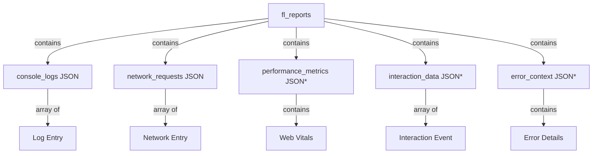

# Data Model: Enhanced Log Visualization

## Overview
Enhanced diagnostic data structure for bug reports, leveraging existing JSON columns while introducing structured schemas for performance metrics, error context, and user interactions.

## Entity Relationship


*New optional columns for Option 2

## Core Entities

### 1. Enhanced Report (extends fl_reports)

#### Existing Fields
```typescript
interface ExistingReport {
  id: string;
  project_id: string;
  type: 'bug' | 'initiative' | 'feedback';
  title: string;
  description: string;
  status: 'active' | 'archived';
  priority: 'low' | 'medium' | 'high' | 'critical' | null;
  reporter_email?: string;
  reporter_name?: string;
  url?: string;
  user_agent?: string;
  console_logs?: ConsoleLogData; // Enhanced structure
  network_requests?: NetworkRequestData; // Enhanced structure
  created_at: string;
  updated_at: string;
}
```

#### New Optional Fields (Option 2)
```typescript
interface EnhancedReport extends ExistingReport {
  performance_metrics?: PerformanceMetrics;
  interaction_data?: InteractionData;
  error_context?: ErrorContext;
}
```

### 2. Console Log Structure (Enhanced)

```typescript
interface ConsoleLogData {
  entries: LogEntry[];
  // New embedded fields for Option 1
  performance_metrics?: PerformanceMetrics;
  error_context?: ErrorContext;
  metadata?: {
    total_count: number;
    error_count: number;
    warning_count: number;
    truncated: boolean;
  };
}

interface LogEntry {
  level: 'error' | 'warn' | 'info' | 'log' | 'debug';
  message: string;
  timestamp: string;
  stack?: string;
  // New fields
  correlation_id?: string; // Links to network requests
  pattern_hash?: string;   // For pattern detection
  occurrence_count?: number;
  source?: {
    file: string;
    line: number;
    column: number;
  };
}
```

### 3. Network Request Structure (Enhanced)

```typescript
interface NetworkRequestData {
  entries: NetworkEntry[];
  metadata?: {
    total_requests: number;
    failed_requests: number;
    total_duration: number;
    total_size: number;
  };
}

interface NetworkEntry {
  // Existing fields
  url: string;
  method: string;
  status: number;
  duration: number;
  timestamp: string;

  // Enhanced fields
  id: string; // For correlation
  type: 'xhr' | 'fetch' | 'script' | 'stylesheet' | 'image' | 'font' | 'other';
  size: {
    request: number;
    response: number;
    total: number;
  };
  timing: {
    dns?: number;
    tcp?: number;
    ssl?: number;
    request: number;
    response: number;
    total: number;
  };
  priority: 'critical' | 'high' | 'medium' | 'low';
  initiator?: string;
  correlation_id?: string; // Links to console errors
  cache_status?: 'hit' | 'miss' | 'dynamic';
}
```

### 4. Performance Metrics (New)

```typescript
interface PerformanceMetrics {
  web_vitals: {
    fcp?: number;  // First Contentful Paint (ms)
    lcp?: number;  // Largest Contentful Paint (ms)
    cls?: number;  // Cumulative Layout Shift (score)
    fid?: number;  // First Input Delay (ms)
    tti?: number;  // Time to Interactive (ms)
    ttfb?: number; // Time to First Byte (ms)
  };
  custom_metrics?: {
    dom_ready?: number;
    window_load?: number;
    first_paint?: number;
  };
  resource_timing?: {
    scripts: ResourceTiming[];
    stylesheets: ResourceTiming[];
    images: ResourceTiming[];
    fonts: ResourceTiming[];
  };
  memory?: {
    used_js_heap_size?: number;
    total_js_heap_size?: number;
    limit?: number;
  };
  categorization?: {
    overall: 'critical' | 'high' | 'medium' | 'low';
    details: string;
  };
}

interface ResourceTiming {
  name: string;
  duration: number;
  size: number;
  cache_status: 'hit' | 'miss';
  blocking_time?: number;
}
```

### 5. Interaction Data (New)

```typescript
interface InteractionData {
  consent_given: boolean;
  consent_timestamp?: string;
  events: InteractionEvent[];
  session_duration?: number;
  engagement_score?: number;
}

interface InteractionEvent {
  type: 'click' | 'scroll' | 'input' | 'navigation' | 'resize';
  timestamp: string;
  target?: {
    element: string;
    id?: string;
    class?: string;
    text?: string;
  };
  metadata?: {
    x?: number;
    y?: number;
    scroll_depth?: number;
    input_length?: number;
    navigation_from?: string;
    navigation_to?: string;
  };
  // Privacy: No PII stored
  anonymized: true;
}
```

### 6. Error Context (New)

```typescript
interface ErrorContext {
  unhandled_errors: ErrorDetail[];
  promise_rejections: PromiseRejection[];
  cors_errors: CorsError[];
  csp_violations: CspViolation[];
  total_error_count: number;
  error_rate?: number;
  patterns?: ErrorPattern[];
}

interface ErrorDetail {
  message: string;
  stack: string;
  timestamp: string;
  type: string;
  file?: string;
  line?: number;
  column?: number;
  user_agent_specific?: boolean;
  frequency?: number;
}

interface PromiseRejection {
  reason: string;
  promise_id?: string;
  timestamp: string;
  handled: boolean;
}

interface CorsError {
  url: string;
  timestamp: string;
  type: 'no-cors' | 'cors-failed' | 'preflight-failed';
}

interface CspViolation {
  directive: string;
  blocked_uri: string;
  timestamp: string;
}

interface ErrorPattern {
  pattern: string;
  count: number;
  first_seen: string;
  last_seen: string;
  affected_components?: string[];
}
```

## Database Schema Changes

### Option 1: Embedded in Existing Columns (No Migration)
```sql
-- No schema changes required
-- Data stored within existing console_logs and network_requests JSON columns
```

### Option 2: Dedicated Columns (Recommended for Scale)
```sql
-- Add new columns to fl_reports table
ALTER TABLE fl_reports
ADD COLUMN IF NOT EXISTS performance_metrics JSON,
ADD COLUMN IF NOT EXISTS interaction_data JSON,
ADD COLUMN IF NOT EXISTS error_context JSON;

-- Create indexes for performance queries
CREATE INDEX IF NOT EXISTS idx_reports_perf_lcp
ON fl_reports((performance_metrics->'web_vitals'->>'lcp')::numeric);

CREATE INDEX IF NOT EXISTS idx_reports_perf_fcp
ON fl_reports((performance_metrics->'web_vitals'->>'fcp')::numeric);

CREATE INDEX IF NOT EXISTS idx_reports_perf_category
ON fl_reports((performance_metrics->'categorization'->>'overall'));

CREATE INDEX IF NOT EXISTS idx_reports_error_count
ON fl_reports((error_context->>'total_error_count')::numeric);

-- Add comments for documentation
COMMENT ON COLUMN fl_reports.performance_metrics IS
'Core Web Vitals and performance timing data collected from browser';

COMMENT ON COLUMN fl_reports.interaction_data IS
'Anonymized user interaction tracking (requires consent)';

COMMENT ON COLUMN fl_reports.error_context IS
'Enhanced error information including stack traces and patterns';
```

## Data Constraints & Validation

### Size Limits
- `console_logs`: Max 5MB (after compression)
- `network_requests`: Max 5MB (after compression)
- `performance_metrics`: Max 500KB
- `interaction_data`: Max 1MB
- `error_context`: Max 2MB
- Total report size: Max 10MB

### Retention Policy
- All diagnostic data retained for project lifetime
- No automatic deletion
- Manual cleanup tools provided

### Privacy Constraints
- No PII in interaction data
- IP addresses anonymized
- User consent required for interaction tracking
- GDPR-compliant data export

## Query Patterns

### Common Queries

#### 1. Reports with Poor Performance
```sql
SELECT id, title,
       (performance_metrics->'web_vitals'->>'lcp')::numeric as lcp,
       (performance_metrics->'categorization'->>'overall') as category
FROM fl_reports
WHERE project_id = ?
  AND (performance_metrics->'web_vitals'->>'lcp')::numeric > 2500
ORDER BY created_at DESC;
```

#### 2. Error Correlation Analysis
```sql
SELECT
  id,
  title,
  (error_context->>'total_error_count')::numeric as error_count,
  jsonb_array_length(network_requests->'entries') as request_count,
  (network_requests->'metadata'->>'failed_requests')::numeric as failed_requests
FROM fl_reports
WHERE project_id = ?
  AND (error_context->>'total_error_count')::numeric > 0
  AND (network_requests->'metadata'->>'failed_requests')::numeric > 0;
```

#### 3. Pattern Detection
```sql
SELECT
  pattern,
  SUM((pattern->>'count')::numeric) as total_occurrences,
  COUNT(DISTINCT report_id) as affected_reports
FROM (
  SELECT
    id as report_id,
    jsonb_array_elements(error_context->'patterns') as pattern
  FROM fl_reports
  WHERE project_id = ?
) patterns
GROUP BY pattern->>'pattern'
ORDER BY total_occurrences DESC;
```

## Migration Strategy

### Phase 1: Embedded Storage
1. Deploy widget with enhanced collection
2. Store in existing JSON columns
3. Monitor performance and size

### Phase 2: Column Migration (When Needed)
1. Add new columns (non-breaking)
2. Dual-write period (both locations)
3. Migrate historical data
4. Switch reads to new columns
5. Remove embedded data

### Rollback Plan
1. Feature flags for new data collection
2. Backward compatible API
3. Gradual rollout by project
4. Quick disable mechanism